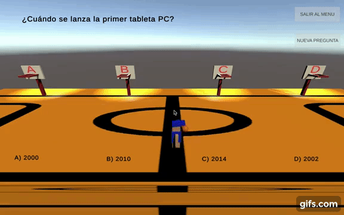
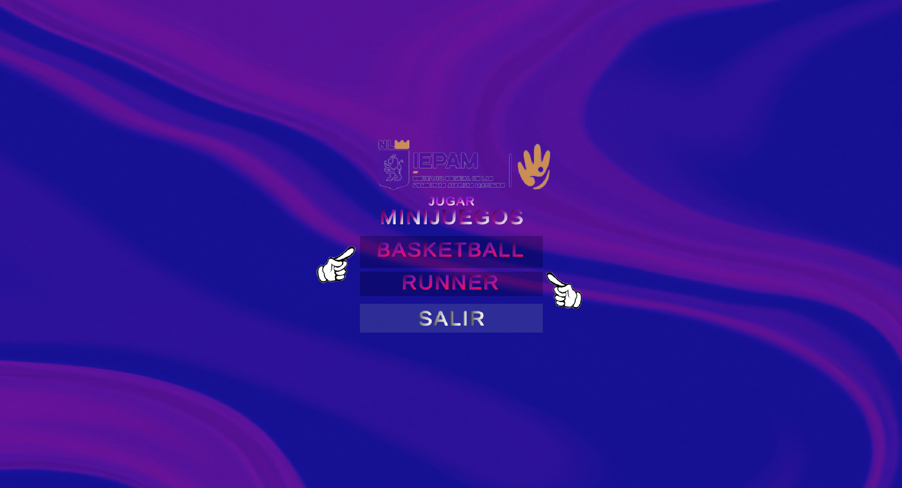
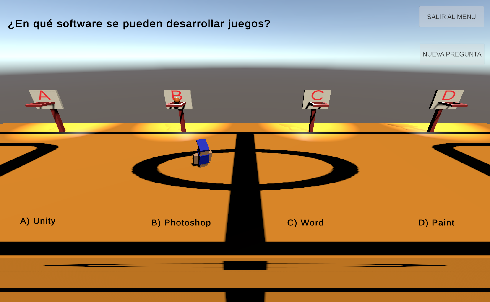
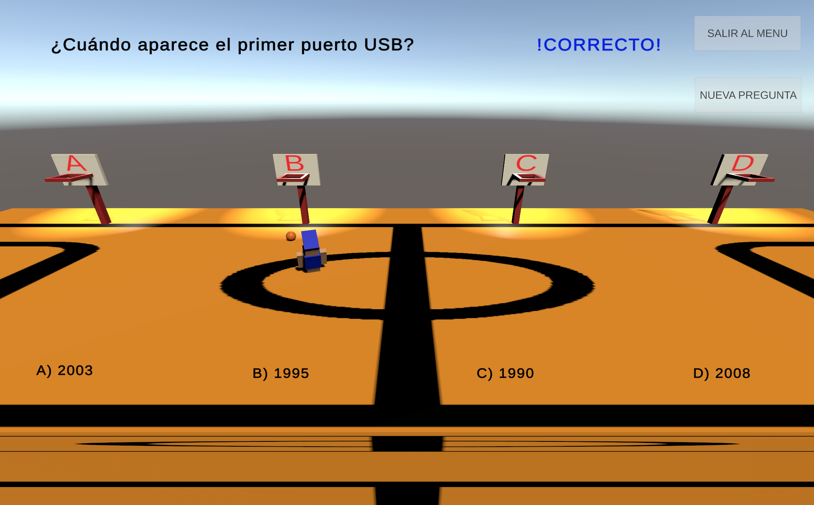
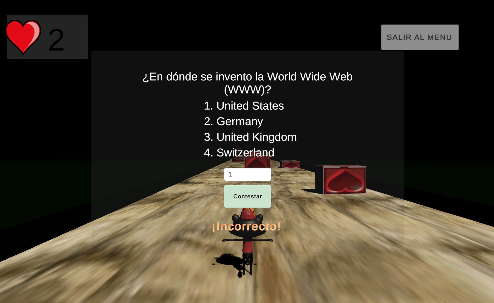
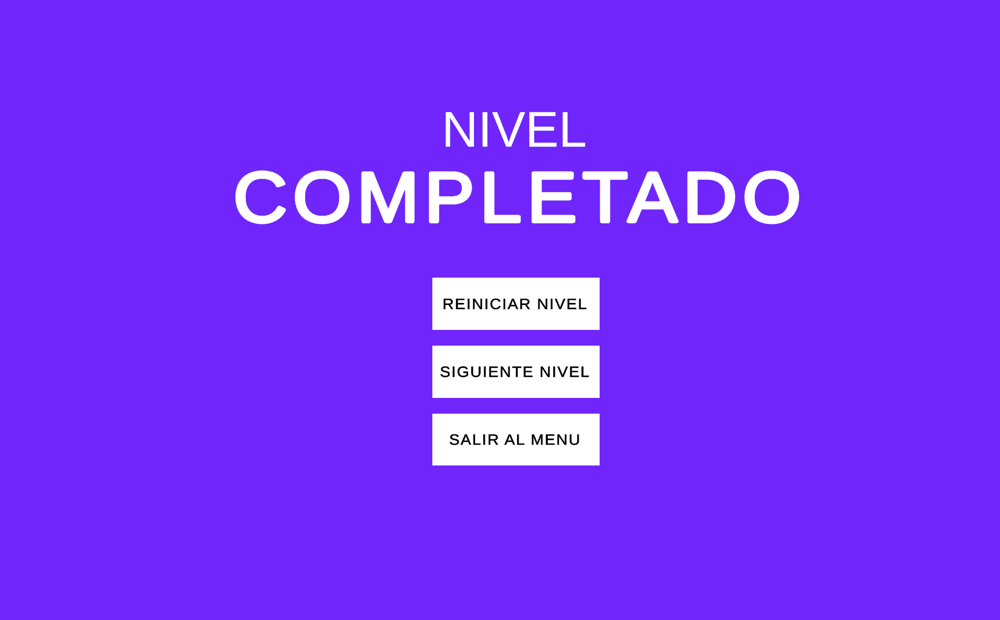
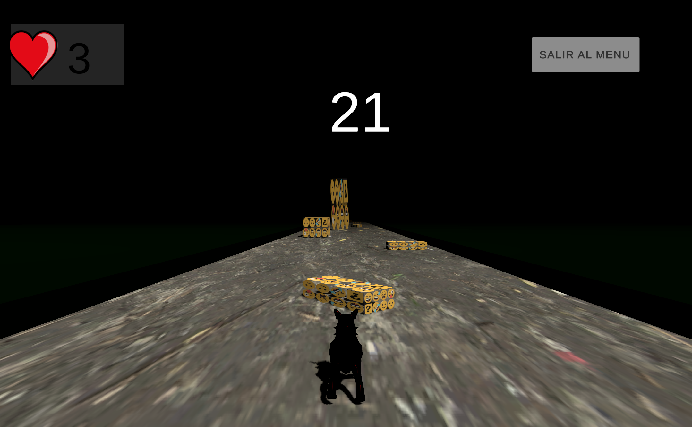
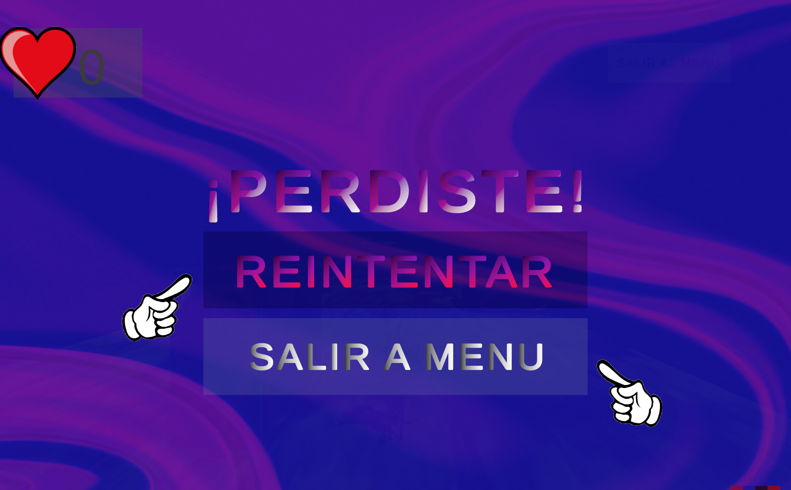

# Unity Videogame IEPAM

Videojuego elaborado para la institución IEPAM "Instituto Estatal Para Adultos Mayores"

*** Elaborado con el editor de juegos Unity version 2021.3.10f1.

    

    

    

    

    

    

    

    

    

    

    

