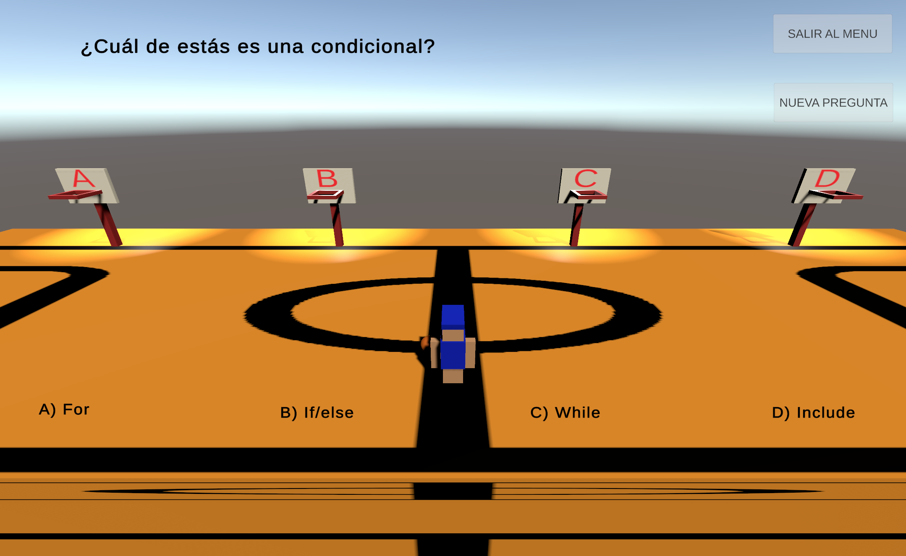
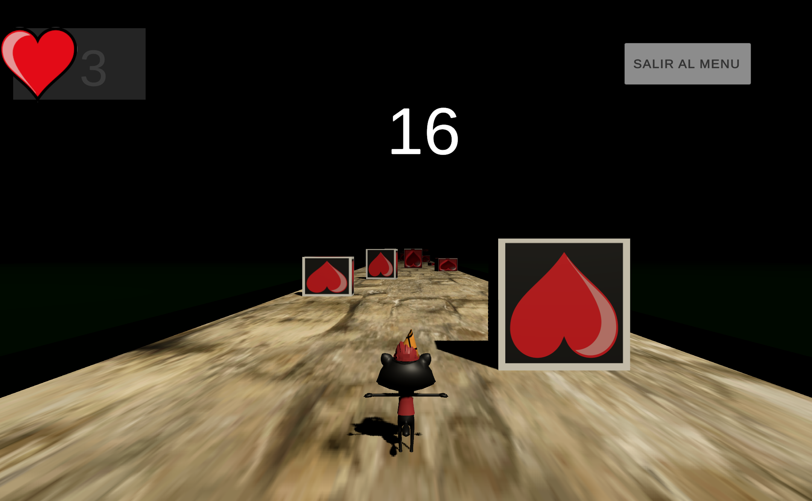
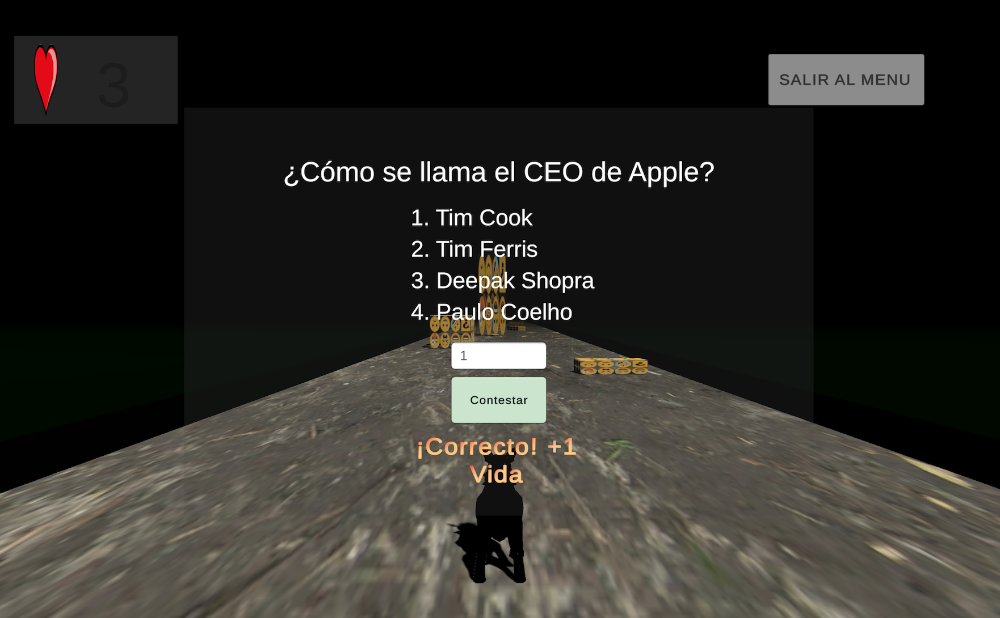

# Unity Videogame IEPAM

Videojuego elaborado para la institución IEPAM "Instituto Estatal Para Adultos Mayores"

*** Elaborado con el editor de juegos Unity version 2021.3.10f1.

<iframe width="1161" height="570" src="https://www.youtube.com/embed/LqJq5Io4gYk" title="Juego Unity IEPAM" frameborder="0" allow="accelerometer; autoplay; clipboard-write; encrypted-media; gyroscope; picture-in-picture" allowfullscreen></iframe>

    

    

    

    

    

    

    

    

    

    

